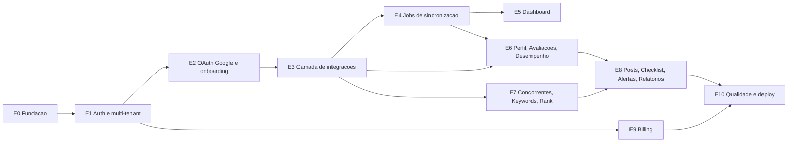

# Backlog de desenvolvimento — Painel GBP

Derivado de [PRD-gbp-dashboard.md](PRD-gbp-dashboard.md), [fluxo-ux.md](fluxo-ux.md) e [schema.prisma](schema.prisma).

**Stack:** Next.js 15 (App Router) · React 19 · TypeScript · Supabase (Auth + Postgres) · Prisma (ORM) · Anthropic SDK · Stripe

**Convenções deste documento**
- `[BLOQUEIA]` — outras tarefas não avançam sem esta.
- Tamanho: `P` (até meio dia), `M` (1–2 dias), `G` (3+ dias).
- "Pronto quando" descreve o critério de aceite verificável.

---

## Ordem das épicas

O caminho crítico é **E0 → E1 → E2 → E3 → E4**. Nada de valor aparece na tela antes do E4 rodar por pelo menos dois ciclos, porque o produto inteiro depende de série histórica. As épicas E6 e E7 podem correr em paralelo depois do E3.

---

## E0 — Fundação do projeto

| # | Tarefa | Tam | Pronto quando |
|---|---|---|---|
| E0-01 | `[BLOQUEIA]` Scaffold Next.js 15 + App Router + TypeScript `strict` + Tailwind. Definir gerenciador de pacotes e travar versões de React 19 / Next 15 | P | `pnpm dev` sobe e o build de produção passa |
| E0-02 | `[BLOQUEIA]` Inicializar repositório git com `.gitignore` cobrindo `.env*`, `node_modules`, `.next` | P | `git status` limpo sem segredos rastreados |
| E0-03 | Mover `schema.prisma` e `migrations/` para `prisma/` na estrutura final do app (hoje estão na raiz do diretório de spec) | P | `prisma migrate status` continua reportando as 3 migrations aplicadas |
| E0-04 | `[BLOQUEIA]` Configurar `datasource` com `url` (pooler de transação, porta 6543, `?pgbouncer=true&connection_limit=1`) e `directUrl` (conexão direta, 5432) | P | `migrate deploy` usa a direta e o runtime usa o pooler; nenhuma conexão esgotada em carga |
| E0-05 | `[BLOQUEIA]` Singleton do Prisma Client com cache em `globalThis` para sobreviver ao hot reload do Next | P | Dev server reinicia dezenas de vezes sem "too many connections" |
| E0-06 | Validação de env com Zod (`DATABASE_URL`, `DIRECT_URL`, chaves Supabase, `ENCRYPTION_KEY`, credenciais Google/SerpApi/DataForSEO/Anthropic/Stripe) + `.env.example` | P | App falha no boot com mensagem clara se faltar variável |
| E0-07 | Clientes Supabase com `@supabase/ssr`: browser, server component, route handler e middleware | M | Sessão sobrevive a navegação e refresh sem re-login |
| E0-08 | Design system base: tokens, tema claro/escuro, componentes de UI (shadcn/ui ou equivalente) | M | Página de referência renderiza todos os componentes base |
| E0-09 | Layout autenticado: sidebar de navegação, topbar com seletor de conta e de negócio, área de conteúdo | M | Navegação entre módulos preserva a seleção ativa |
| E0-10 | `error.tsx`, `loading.tsx`, `not-found.tsx` e error boundary global com captura de erro | P | Erro em Server Component mostra fallback em vez de tela branca |
| E0-11 | Lint + format + type-check em CI, rodando em cada PR | P | PR com erro de tipo não faz merge |
| E0-12 | Definir a política de runtime: rotas que usam Prisma declaram `runtime = 'nodejs'` | P | Nenhuma rota com Prisma cai em Edge Runtime no build |

**Nota sobre E0-04:** a `DATABASE_URL` configurada hoje é a conexão direta, correta para migrations mas errada para o runtime serverless — cada invocação abre uma conexão nova e o Postgres do Supabase esgota. O pooler de transação resolve, e por isso o `directUrl` existe: o Prisma usa a direta só para migrar.

---

## E1 — Autenticação e multi-tenant

| # | Tarefa | Tam | Pronto quando |
|---|---|---|---|
| E1-01 | `[BLOQUEIA]` Páginas de cadastro, login, esqueci-a-senha e callback (`/auth/callback`) usando Supabase Auth | M | Fluxo completo de e-mail+senha funciona ponta a ponta |
| E1-02 | Login social com Google (escopo básico de identidade) | P | Botão "entrar com Google" cria sessão válida |
| E1-03 | `[BLOQUEIA]` Middleware de refresh de sessão + proteção de rotas privadas | M | Rota privada sem sessão redireciona para login preservando o destino |
| E1-04 | `[BLOQUEIA]` Provisionamento na primeira sessão, em transação: linha em `users` (id = id do Supabase Auth) + `Account` + `AccountMember` OWNER + `Subscription` TRIALING no plano FREE | M | Cadastro novo termina com as 4 linhas criadas; repetir o login não duplica nada |
| E1-05 | `[BLOQUEIA]` Helpers de sessão e tenant: `getSession()`, `getActiveAccount()`, `requireAccountRole()` | M | Toda página privada resolve o tenant ativo por uma única função |
| E1-06 | `[BLOQUEIA]` Guarda de isolamento por `accountId` em todas as queries, com helper `assertBusinessAccess(businessId)` | M | Tentativa de acessar `businessId` de outra conta retorna 404, não 403 (não vaza existência) |
| E1-07 | Seletor de conta ativa para usuários em múltiplas contas, persistido em cookie | M | Trocar de conta troca todos os dados da tela |
| E1-08 | Tela de configurações da conta: nome, membros, papéis | M | OWNER vê e edita; MEMBER só visualiza |
| E1-09 | Convite de membro por e-mail com token e expiração | M | Convidado aceita e vira `AccountMember` MEMBER |

**Estado da E1:** completa. E1-01 fechou com `/recuperar-senha` e
`/nova-senha` — a rota de recuperação já estava liberada no middleware, mas a
página não existia; E1-02 entrou como `EntrarComGoogle` no login e no cadastro,
com escopo só de identidade. E1-07 a E1-09 (seletor de conta, configurações,
convites) foram entregues junto com as lacunas de schema.

**Alerta de segurança em E1-06:** o Prisma se conecta ao Postgres como dono do banco, então **RLS do Supabase é ignorada** — a política de linha não protege nada nesse caminho. Todo o isolamento entre tenants tem que ser garantido em código, em cada `where`. Vale escrever um teste que tenta cruzar contas e espera falha.

**Lacuna de schema em E1-09:** não existe model `Invite`. Precisa de migration nova com `Invite { id, accountId, email, role, token, expiresAt, acceptedAt }`.

---

## E2 — Conexão com o Google e onboarding

| # | Tarefa | Tam | Pronto quando |
|---|---|---|---|
| E2-01 | `[BLOQUEIA]` Tarefa operacional: criar projeto no Google Cloud, ativar as 4 APIs na Biblioteca, submeter o pedido de allowlist e o pedido separado da API v4 | M | Pedidos protocolados; prazo de 7–10 dias úteis documentado no runbook |
| E2-02 | `[BLOQUEIA]` Serviço de criptografia de tokens (AES-256-GCM com `node:crypto`, chave em env, IV por registro) | M | Token gravado no banco é ilegível; round-trip encrypt/decrypt testado |
| E2-03 | `[BLOQUEIA]` Rota de início do OAuth: `state` assinado, `access_type=offline`, `prompt=consent`, escopo `business.manage` | M | Consent screen abre e retorna com `code` e `state` íntegro |
| E2-04 | `[BLOQUEIA]` Callback: troca `code` por tokens, criptografa, grava `GoogleConnection` com `connectedByUserId` e `tokenExpiry` | M | Conexão aparece como ACTIVE nas configurações |
| E2-05 | `[BLOQUEIA]` Serviço de refresh de token: renova antes de expirar, marca EXPIRED/REVOKED no erro, serializa chamadas concorrentes | M | Token vencido é renovado transparentemente; revogação no Google vira status REVOKED |
| E2-06 | Listagem de contas e locais via Account Management API, com paginação | M | Conta com mais de 100 locais lista tudo |
| E2-07 | Tela de seleção de locais com checkbox, contador e bloqueio ao exceder `Plan.maxBusinesses` | M | Exceder o limite leva ao checkout, não a um erro |
| E2-08 | `[BLOQUEIA]` Sync inicial: perfil (Business Information) → performance disponível → reviews (v4) → auditoria → checklist | G | Negócio recém-conectado abre o dashboard com dados reais |
| E2-09 | Tela de bloqueio para 403/cota zero, distinguindo allowlist geral de allowlist da v4 | M | Usuário entende o que está pendente e o prazo |
| E2-10 | Onboarding de ticket médio e taxa de conversão, com opção de pular | P | Pular grava nada e o cálculo cai no `SegmentBenchmark` da categoria |
| E2-11 | Reconectar / trocar conta Google / revogar conexão | M | Revogar mantém histórico e bloqueia escrita |

---

## E3 — Camada de integrações externas

| # | Tarefa | Tam | Pronto quando |
|---|---|---|---|
| E3-01 | `[BLOQUEIA]` Cliente HTTP base: retry com backoff exponencial, timeout, tratamento de 429, log estruturado de cota por API | M | 429 do SerpApi não derruba o job; aparece no log com a cota restante |
| E3-02 | Wrapper da Business Information API: `getLocation`, `updateLocation`, categorias, horários, serviços | M | Edição de perfil ida e volta sem perder campo |
| E3-03 | Wrapper da Performance API: métricas diárias por tipo + `searchkeywords/impressions/monthly` | M | Retorna série diária normalizada pronta para upsert |
| E3-04 | Wrapper da API v4: `reviews.list`, `reviews.updateReply`, `localPosts.create` | M | Publicar resposta reflete no perfil real |
| E3-05 | Wrapper da Places API (New): busca de concorrentes preservando a ordem de relevância do Google | M | Ordem retornada é idêntica à do Google, sem reordenação |
| E3-06 | Wrapper do SerpApi: consulta por ponto geográfico, com contabilização de cota antes de disparar grid | M | Grid 5x5 só dispara se houver 25 buscas disponíveis |
| ~~E3-07~~ | ~~Wrapper do DataForSEO~~ → **substituído pelo Keyword Planner do Google Ads** (`src/lib/google/ads.ts`) | P | ✅ volume com cache mensal; segunda chamada no mês não consome API |
| E3-08 | `[BLOQUEIA]` Serviço Anthropic com o SDK oficial `@anthropic-ai/sdk`, modelo `claude-opus-5`, thinking adaptativo e streaming nas gerações longas | M | Quatro casos de uso funcionam: resposta a avaliação, recomendação de auditoria, sugestão de keywords, texto de post |
| E3-09 | Prompts versionados por caso de uso, com tom configurável por negócio | M | Trocar o tom muda o rascunho gerado |
| E3-10 | Camada de erro de integração: mapear falha de cada API para uma mensagem de UI acionável | M | Nenhum erro de API vaza stack trace para a tela |

**Sobre E3-08:** o SDK é `@anthropic-ai/sdk` e o modelo padrão é `claude-opus-5`. Use `thinking: { type: "adaptive" }` para as tarefas que exigem raciocínio (recomendações de auditoria) e streaming com `.finalMessage()` para qualquer geração com `max_tokens` alto — sem streaming, o timeout HTTP do SDK derruba a requisição. Não use `temperature`, `top_p` nem `budget_tokens`: esses parâmetros retornam 400 nos modelos atuais.

**Lacuna de schema em E3-09:** o PRD pede tom configurável por negócio (5.4), mas `Business` não tem esse campo. Precisa de migration com `Business.tomDeVoz String?`.

---

## E4 — Jobs de sincronização

| # | Tarefa | Tam | Pronto quando |
|---|---|---|---|
| E4-01 | `[BLOQUEIA]` Infraestrutura de cron (Vercel Cron ou pg_cron) com endpoint protegido por secret e `maxDuration` ajustado | M | Endpoint recusa chamada sem o header de segredo |
| E4-02 | `[BLOQUEIA]` Registro de execução de job: início, fim, itens processados, erro | M | Falha de job é auditável sem ler log de plataforma |
| E4-03 | `[BLOQUEIA]` Lock por negócio para impedir execução concorrente do mesmo sync | M | Duas invocações simultâneas processam o negócio uma vez só |
| E4-04 | `[BLOQUEIA]` Job diário de Performance com upsert por `businessId+date` e janela de reprocessamento de 5 dias | G | Dado que o Google corrigiu retroativamente é atualizado, sem duplicar linha |
| E4-05 | Job diário de Reviews com upsert por `businessId+gbpReviewId` | M | Avaliação editada pelo autor atualiza o cache |
| E4-06 | Job diário de auditoria: novo `AuditSnapshot` + regeneração de `ChecklistItem` preservando DONE/DISMISSED | M | Item já resolvido não volta como OPEN |
| E4-07 | `[BLOQUEIA]` Gerador de alertas comparando snapshots: `NEW_REVIEW`, `LOW_RATING_REVIEW`, `RATING_DROP`, `NO_ACTIVITY`, `SYNC_FAILED` | G | Cada tipo dispara em cenário de teste controlado |
| E4-08 | Job semanal de concorrentes gravando `CompetitorSnapshot` | M | Série de evolução do concorrente aparece no módulo |
| E4-09 | Job semanal de rank tracking + alerta `RANK_DROP` na queda de posição | M | Piora de posição gera alerta uma vez, não a cada execução |
| E4-10 | Job mensal de revalidação de `Keyword.volume` | P | `volumeSyncedAt` avança mensalmente |
| E4-11 | Publicador de posts agendados (`state=SCHEDULED` com `scheduledFor` vencido) | M | Post agendado publica na janela e vira PUBLISHED, ou FAILED com mensagem |
| E4-12 | Fila e paralelismo controlado para contas com muitos negócios | G | Conta com 20 negócios completa o sync diário dentro da janela |

**Lacuna de schema em E4-02:** não existe model para log de execução. Precisa de migration com `SyncRun { id, businessId?, jobType, status, itemsProcessed, errorMessage, startedAt, finishedAt }`.

**Ponto de atenção em E4-04:** a Performance API do Google publica dados com atraso e corrige números já entregues. Por isso o job não pode só buscar "ontem" — precisa reprocessar uma janela móvel, senão o "vs. período anterior" fica permanentemente errado.

---

## E5 — Dashboard

| # | Tarefa | Tam | Pronto quando |
|---|---|---|---|
| E5-01 | `[BLOQUEIA]` Camada de agregação: soma por período, período anterior equivalente, variação percentual | G | Comparar dois intervalos arbitrários não chama nenhuma API externa |
| E5-02 | Seletor de período (7d/30d/90d/customizado) refletido na URL | M | Compartilhar o link reabre o mesmo recorte |
| E5-03 | Cards de topo com valor, delta e estado vazio quando não há histórico | M | Conta nova mostra valor absoluto e aviso, não `NaN` nem `-100%` |
| E5-04 | `[BLOQUEIA]` Módulo de cálculo das métricas estimadas (5.9), isolado e coberto por testes unitários | M | Fórmulas testadas com casos de borda: zero visualizações, ticket nulo, categoria sem benchmark |
| E5-05 | Bloco "Receita perdida" + página "Entenda como calculamos isso" com a fórmula e a fonte | M | Link visível em todo bloco estimado |
| E5-06 | Bloco "Principais motivos" (top `ChecklistItem` OPEN por peso) | P | Clicar leva ao módulo que resolve o item |
| E5-07 | Bloco "Desempenho financeiro estimado" | M | Números batem com o módulo de cálculo |
| E5-08 | Bloco "Fontes de receita" (Search x Maps) | M | Proporção soma 100% |
| E5-09 | Bloco "Conversão do perfil" comparado ao benchmark do segmento | M | Mostra o próprio número e o de referência lado a lado |
| E5-10 | Bloco "Maior oportunidade agora" gerado por IA a partir da auditoria | M | Recomendação muda quando o checklist muda |
| E5-11 | Gráficos de evolução (desempenho e nota da auditoria) | M | Séries longas renderizam sem travar |
| E5-12 | Badge de alertas não lidos com link para o módulo | P | Contador zera ao abrir |

**Decisão de produto: rank tracking em grade fica fora do escopo.** Uma grade
5x5 consome 25 das 100 buscas mensais gratuitas do SerpApi, e a leitura que
ela entrega não é valorizada pelo cliente na proporção do custo. A Análise de
Mercado (E7-11) permanece: gasta 1 busca por consulta e serve à prospecção,
que é o uso comercial de fato.

Consequência no schema: `RankCheck`, `RankCheckPoint` e o enum `RankCheckType`
ficam sem uso. Não removi as tabelas — elas não atrapalham e a decisão pode
ser revista se um cliente pedir.

**Risco em E5-04/E5-05:** o PRD marca isso explicitamente como risco de credibilidade. Se a estimativa destoar da realidade do cliente, o produto inteiro perde confiança. Manter o cálculo isolado e testado é o que permite ajustar a fórmula depois sem caçar lógica espalhada pela UI.

---

## E6 — Perfil, Avaliações e Desempenho

| # | Tarefa | Tam | Pronto quando |
|---|---|---|---|
| E6-01 | Tela de Perfil com edição de todos os campos via Business Information API | G | Salvar reflete no Google e atualiza o cache local |
| E6-02 | Tratamento de erro de validação e campo em revisão pelo Google | M | Motivo do Google aparece no formulário, valor anterior preservado |
| E6-03 | Tela de Auditoria: nota, checklist com pesos, gráfico de evolução | M | Rodar auditoria manualmente gera novo snapshot |
| E6-04 | Lista de avaliações com filtros (sem resposta, nota ≤ 3, período) e paginação | M | Filtro combina com busca textual |
| E6-05 | Métrica "% respondidas em até 48h" calculada de `createTime`/`repliedAt` | P | Bate com contagem manual em amostra |
| E6-06 | Geração de rascunho por IA + editor + publicação da resposta | G | Rascunho salvo em `aiDraftReply`, publicado grava `replyText` e `repliedAt` |
| E6-07 | Tela de Desempenho: gráfico por métrica, breakdown Search x Maps, comparação de intervalos | G | Toda leitura vem de `PerformanceDaily`, sem chamada externa |
| E6-08 | Aviso de limitação sobre WhatsApp não rastreável | P | Texto presente na tela de Desempenho |

---

## E7 — Concorrentes, Palavras-chave e Rank

| # | Tarefa | Tam | Pronto quando |
|---|---|---|---|
| E7-01 | Busca e listagem de concorrentes preservando a ordem do Google | M | Nenhuma reordenação por nota ou score próprio |
| E7-02 | Marcar concorrentes para acompanhar (`Competitor`) e comparativo lado a lado | M | Comparativo mostra nota, nº de avaliações, site e horários |
| E7-03 | Evolução do concorrente a partir de `CompetitorSnapshot` | M | Gráfico aparece após o segundo snapshot |
| E7-04 | CRUD de palavras-chave com limite de plano e sugestão por IA | M | Exceder `maxKeywords` leva ao checkout |
| E7-05 | ✅ Exibição de volume com estado "indisponível" quando o Google Ads falha ou não tem dado | P | Ausência de volume não quebra a tela |
| ~~E7-06~~ | ~~Rank check SINGLE e GRID~~ | — | **Fora de escopo** — ver decisão abaixo |
| ~~E7-07~~ | ~~Mapa de calor da grade~~ | — | **Fora de escopo** |
| ~~E7-08~~ | ~~Guarda de cota do SerpApi para grid~~ | — | **Fora de escopo** |
| ~~E7-09~~ | ~~Gráfico de evolução de posição~~ | — | **Fora de escopo** |
| E7-10 | Aviso de produto: rank é sempre relativo ao ponto geográfico | P | Já presente na Análise de Mercado |
| E7-11 | Análise de Mercado: busca de qualquer negócio, keyword por IA ou digitada, gravação em `MarketScan` | G | Analisa negócio não rastreado sem exigir OAuth |
| E7-12 | Histórico de scans da conta para acompanhamento comercial | M | Lista ordenada por data com o resultado preservado |

---

## E8 — Postagens, Checklist, Alertas e Relatórios

| # | Tarefa | Tam | Pronto quando |
|---|---|---|---|
| E8-01 | Editor de post com tipo (STANDARD/EVENT/OFFER), mídia opcional e geração de texto por IA | G | Rascunho salva sem publicar |
| E8-02 | Agendamento com `scheduledFor` e publicação imediata | M | Estados DRAFT/SCHEDULED/PUBLISHED/FAILED transitam corretamente |
| E8-03 | Tratamento de falha de publicação com `errorMessage` e reenvio | M | Post FAILED pode ser corrigido e republicado |
| E8-04 | Métrica de frequência de postagem alimentando o dashboard | P | Aparece como "principal motivo" quando baixa |
| E8-05 | Tela de checklist agrupada por área e prioridade, com marcar-feito e dispensar | M | Status persiste e some da lista de pendências |
| E8-06 | Links profundos do checklist para o módulo que resolve cada item | M | Item de descrição leva ao campo de descrição no Perfil |
| E8-07 | Central de alertas com severidade, marcação de leitura e link contextual | M | Abrir grava `readAt` |
| E8-08 | Notificação por e-mail para alertas CRITICAL | M | E-mail sai uma vez por alerta |
| E8-09 | Geração de relatório PDF por período (render server-side do dashboard) | G | PDF abre com os números do período escolhido |
| E8-10 | Exportação CSV | M | Colunas documentadas e importáveis em planilha |
| E8-11 | Persistência em `Report` e download por link | P | Relatório antigo continua acessível |

**Lacuna em E8-08:** não há model de preferência de notificação. Ou notifica todos os OWNER da conta por padrão, ou entra migration com `NotificationPreference`.

---

## E9 — Billing e planos

| # | Tarefa | Tam | Pronto quando |
|---|---|---|---|
| E9-01 | Criar produtos e preços no Stripe e preencher `Plan.stripePriceId` | P | Os 3 planos têm price id válido |
| E9-02 | Revisar preços e limites do seed (hoje são placeholder) | P | Valores definidos pelo negócio, não pelo seed |
| E9-03 | `[BLOQUEIA]` Checkout do Stripe criando/atualizando `Subscription` | M | Pagamento aprovado ativa o plano |
| E9-04 | `[BLOQUEIA]` Webhook do Stripe com verificação de assinatura e idempotência | G | Evento duplicado não altera o estado duas vezes |
| E9-05 | Estados PAST_DUE e CANCELED bloqueando recursos pagos sem apagar dados | M | Downgrade preserva histórico |
| E9-06 | Enforcement de `maxBusinesses` e `maxKeywords` em toda criação | M | Nenhum caminho contorna o limite |
| E9-07 | Portal de gerenciamento de assinatura | P | Usuário troca cartão e cancela sozinho |
| E9-08 | Política de downgrade: o que acontece com negócios excedentes | M | Comportamento definido e implementado |

**Estado da E9:** E9-03 a E9-07 implementados — checkout, webhook com
idempotência (`stripe_events`), bloqueio por status e portal, em
`/conta/plano` e `/api/stripe/webhook`. Restam E9-01 e E9-02, que são
operacionais e dependem de decisão comercial: criar os produtos no Stripe,
definir preço e limites de verdade (o seed usa R$ 97 / R$ 297 como
placeholder) e preencher `Plan.stripePriceId`. O enforcement de limites
(E9-06) já existia nas criações e agora divide a mesma guarda de status.

**Decisão pendente em E9-08:** o PRD não define se, ao cair de plano, os negócios excedentes são pausados automaticamente, bloqueados para leitura ou se o usuário escolhe quais manter. Precisa de decisão de produto antes da implementação — é a única tarefa deste backlog que não dá para começar sem resposta.

---

## E10 — Qualidade, segurança e deploy

| # | Tarefa | Tam | Pronto quando |
|---|---|---|---|
| E10-01 | Testes unitários das fórmulas estimadas e do cálculo da auditoria | M | Cobertura das regras de negócio críticas |
| E10-02 | Testes de integração com banco de teste (Prisma + Postgres efêmero) | G | Suite roda em CI sem tocar produção |
| E10-03 | Teste E2E do onboarding completo (Playwright) | G | Do cadastro ao primeiro dashboard, com APIs mockadas |
| E10-04 | `[BLOQUEIA]` Auditoria de isolamento entre tenants | M | Teste que tenta acessar dado de outra conta falha em todas as rotas |
| E10-05 | Rate limiting nas rotas que disparam APIs pagas | M | Usuário não consegue queimar cota do SerpApi em loop |
| E10-06 | Observabilidade: Sentry, log estruturado dos jobs, alerta de job que não rodou | M | Job silenciosamente parado gera alerta |
| E10-07 | Deploy na Vercel com envs de preview e produção separadas | M | Preview usa banco de staging, nunca o de produção |
| E10-08 | Runbook: allowlist do Google, billing das APIs, rotação de segredos, restore de backup | M | Documento revisado por quem não construiu o sistema |
| E10-09 | Rotação da senha do banco e das chaves de API antes do go-live | P | Nenhum segredo usado em desenvolvimento sobrevive em produção |

**Estado da E10:**

| # | Estado |
|---|---|
| E10-01 | ✅ `estimativas.test.ts`, `auditoria.test.ts`, `negocio.test.ts`, `plano.test.ts` |
| E10-02 | ✅ suíte `*.itest.ts` com Postgres efêmero (job `integracao` no CI) |
| E10-03 | ✅ `e2e/` com Playwright e um Supabase Auth de mentira (job `e2e` no CI) |
| E10-04 | ✅ auditoria estática (`isolamento.test.ts`) + prova em runtime (`isolamento.itest.ts`) |
| E10-05 | ✅ `src/lib/rate-limit.ts`, ligado em SerpApi, Places, IA e volume |
| E10-06 | ✅ `sync_runs`, `/api/cron/monitor-jobs` e Sentry com DSN opcional |
| E10-07 | ⬜ operacional, depende do acesso à Vercel |
| E10-08 | ✅ [RUNBOOK.md](RUNBOOK.md) |
| E10-09 | ⬜ operacional, procedimento documentado no runbook §5 |

**Sobre o E2E:** o Supabase Auth é substituído por `e2e/mock-supabase.mjs`.
Apontar para o Supabase real exigiria segredo no CI, criaria usuários de
verdade a cada execução e deixaria a suíte à mercê de um serviço externo. O
que fica de fora, então, é o próprio Supabase — tudo do nosso lado da fronteira
é exercitado de verdade, em navegador e banco reais.

**Sobre a escolha em E10-04:** a auditoria é estática — varre todo arquivo com
`"use server"` sob `src/app` e exige que ele chame uma das guardas de tenant,
com uma lista explícita de exceções justificadas. Um teste de integração
provaria que as ações de hoje isolam; este falha no instante em que alguém
adiciona uma ação sem guarda, que é quando o erro é barato. Ele prova que a
guarda foi chamada, não que o argumento passado a ela é o certo — não
substitui revisão de código.

---

## Migrations adicionais necessárias

Quatro lacunas entre o PRD e o `schema.prisma` inicial. **Todas resolvidas** na
migration `prisma/migrations/3_lacunas` (espelhada em `sql/004_lacunas.sql`),
que é aditiva — nenhuma coluna existente muda de tipo:

| Model / campo | Para quê | Desbloqueou |
|---|---|---|
| `Invite` | Convite de membro de equipe | E1-09 |
| `Business.tomDeVoz` | Tom configurável das respostas de IA (PRD 5.4) | E3-09 |
| `SyncRun` | Log de execução dos jobs | E4-02 |
| `NotificationPreference` | Quem recebe e-mail de alerta crítico | E8-08 |

A E9 exigiu uma quinta: `prisma/migrations/4_billing` (`sql/005_billing.sql`)
com `StripeEvent` para a idempotência do webhook e
`Subscription.cancelAtPeriodEnd`.

Ambas já aplicadas com `pnpm db:migrate`.

**Atenção ao `DIRECT_URL`:** use o session pooler (porta 5432 do host do
pooler). O host de conexão direta `db.<projeto>.supabase.co` só tem registro
AAAA — em rede sem IPv6 o Prisma falha com `P1001`, que parece projeto pausado
e não é.

---

## Sequência recomendada de entrega

1. **Semana 1–2** — E0 completo + E1 até E1-06. Nada é visível ainda, mas é onde mora todo o risco estrutural (pooling, isolamento de tenant, sessão).
2. **Semana 3–4** — E2 completo. Depende do allowlist do Google, que é o único item de prazo externo: **submeta E2-01 no primeiro dia do projeto**, não quando chegar a vez dele.
3. **Semana 5–6** — E3 + E4-01 a E4-07. Ao fim, o sistema já acumula histórico sozinho.
4. **Semana 7–8** — E5 + E6. Primeira versão demonstrável para cliente.
5. **Semana 9–10** — E7 (as features "uau" de venda) e E8.
6. **Semana 11–12** — E9 + E10.

O único prazo que não depende de você é o allowlist do Google (7–10 dias úteis, e por projeto do Cloud, não por API). Ele fica no caminho crítico de tudo que lê dado privado, então protocolar cedo é o que evita duas semanas paradas no meio do projeto.
